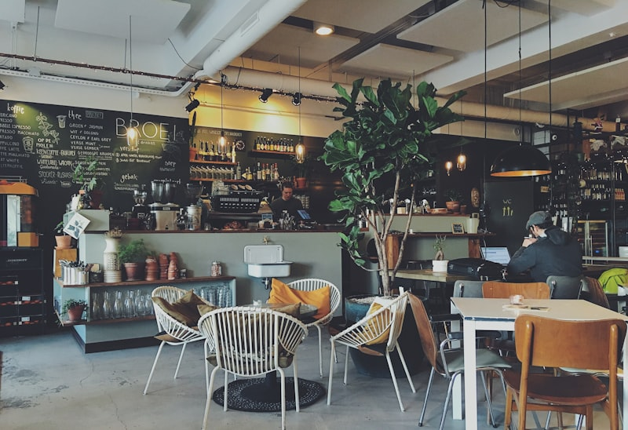

# Cafe Loma UG - Website

Eine moderne, DSGVO-konforme Website für die Cafe Loma UG - Premium Tagesbar in Wesel.

## 🚀 Deployment

### Auf Netlify deployen

1. **ZIP-Datei erstellen:**
   ```bash
   # Alle Dateien im Projekt-Root auswählen und zippen
   # Wichtig: Nicht den Ordner selbst zippen, sondern den Inhalt!
   ```

2. **Bei Netlify hochladen:**
   - Gehe zu [netlify.com](https://netlify.com) und melde dich an
   - Drag & Drop deine ZIP-Datei auf die Netlify-Startseite
   - Oder: "Add new site" → "Deploy manually" → ZIP hochladen

3. **Fertig!** Die Website ist sofort live unter einer Netlify-Subdomain.

### Eigene Domain verbinden

1. In den Netlify Site Settings → Domain management
2. "Add custom domain" → Deine Domain eingeben
3. DNS-Einstellungen bei deinem Domain-Provider anpassen (wie von Netlify angegeben)

## 🔧 Web3Forms API-Key einfügen

Das Kontaktformular verwendet [Web3Forms](https://web3forms.com/) für die E-Mail-Zustellung.

### Schritt-für-Schritt:

1. **Kostenloses Konto erstellen:**
   - Gehe zu [web3forms.com](https://web3forms.com/)
   - Klicke auf "Get Started" oder "Create Form"
   - Gib deine E-Mail-Adresse ein: `kamyar.behzad@web.de`
   - Bestätige die E-Mail-Verifizierung

2. **Access Key kopieren:**
   - Nach der Verifizierung erhältst du einen Access Key
   - Sieht aus wie: `c4f5d8e1-2a3b-4c5d-6e7f-8a9b0c1d2e3f`

3. **In die Website einfügen:**
   - Öffne `index.html`
   - Suche nach: `value="HIER_DEIN_WEB3FORMS_KEY_EINFÜGEN"`
   - Ersetze durch deinen echten Key
   - Beispiel:
     ```html
     <input type="hidden" name="access_key" value="c4f5d8e1-2a3b-4c5d-6e7f-8a9b0c1d2e3f">
     ```

4. **Testen:**
   - Formular auf der Website ausfüllen und absenden
   - Prüfe dein E-Mail-Postfach (auch Spam-Ordner!)

## 🖼️ Eigene Bilder hinzufügen

### Ordnerstruktur:
```
cafe-loma/
├── images/
│   ├── hero.jpg           # Haupt-Hintergrundbild (empfohlen: 1920x1080px)
│   ├── about.jpg          # Über-uns Bild (empfohlen: 800x1000px)
│   └── gallery/
│       ├── 1.jpg          # Galerie-Bilder (empfohlen: 800x800px)
│       ├── 2.jpg
│       ├── 3.jpg
│       ├── 4.jpg
│       └── 5.jpg
```

### Bilder einfügen:

1. **Bilder vorbereiten:**
   - Optimiere Bilder für Web (z.B. mit [squoosh.app](https://squoosh.app/))
   - Empfohlene Formate: JPG für Fotos, PNG für Grafiken mit Transparenz
   - Maximale Dateigröße: 500KB pro Bild

2. **Im Code ersetzen:**

   **Hero-Bereich** (`index.html`, Zeile ~80):
   ```html
   <!-- ALT: -->
   
   
   <!-- NEU: -->
   
   ```

   **Über-uns Bereich** (`index.html`, Zeile ~140):
   ```html
   
   ```

   **Galerie** (`index.html`, Zeile ~200):
   ```html
   
   
   <!-- usw. -->
   ```

## 📁 Projektstruktur

```
cafe-loma/
├── index.html              # Startseite
├── impressum.html          # Impressum
├── datenschutz.html        # Datenschutzerklärung
├── _redirects              # Netlify Redirect-Konfiguration
├── _headers                # Netlify Security Headers
├── README.md               # Diese Datei
├── css/
│   ├── variables.css       # Design-System (Farben, Typography)
│   ├── base.css           # Reset & Base-Styles
│   ├── components.css     # UI-Komponenten
│   ├── layout.css         # Layout & Navigation
│   ├── pages.css          # Seiten-spezifische Styles
│   └── cookie-banner.css  # Cookie-Banner Styles
├── js/
│   ├── cookie-banner.js   # DSGVO Cookie-Banner
│   ├── form-handler.js    # Web3Forms Integration
│   └── main.js            # Haupt-JavaScript
├── fonts/                  # Lokale Schriftarten (optional)
└── images/                 # Deine Bilder
    ├── hero.jpg
    ├── about.jpg
    └── gallery/
```

## 🎨 Anpassungen

### Farben ändern

In `css/variables.css`:
```css
:root {
  --color-primary: #00502b;        /* Hauptfarbe (Grün) */
  --color-primary-dark: #003d21;   /* Dunklere Variante */
  --color-primary-light: #006b3a;  /* Hellere Variante */
  /* ... */
}
```

### Texte ändern

Einfach die HTML-Dateien in einem Texteditor öffnen und den Text anpassen. Alle Texte sind gut strukturiert und kommentiert.

### Neue Seite hinzufügen

1. Neue HTML-Datei erstellen (z.B. `speisekarte.html`)
2. Struktur von `impressum.html` kopieren
3. Inhalt anpassen
4. Navigation in allen Dateien aktualisieren

## ♿ Barrierefreiheit

Die Website wurde mit Fokus auf Barrierefreiheit entwickelt:
- Semantisches HTML5
- ARIA-Labels
- Tastaturnavigation
- Ausreichende Kontrastverhältnisse
- Screenreader-kompatibel

## 📱 Browser-Support

- Chrome (letzte 2 Versionen)
- Firefox (letzte 2 Versionen)
- Safari (letzte 2 Versionen)
- Edge (letzte 2 Versionen)
- Mobile Safari (iOS)
- Chrome Mobile (Android)

## ⚡ Performance

- Keine externen Schriftarten (lokales System Font Stack)
- Minimaler JavaScript-Code
- Optimierte CSS-Struktur
- Bilder sollten lazy-loaded werden (bereits implementiert)

## 📞 Support

Bei Fragen oder Problemen:
- Web3Forms Dokumentation: [docs.web3forms.com](https://docs.web3forms.com/)
- Netlify Dokumentation: [docs.netlify.com](https://docs.netlify.com/)

---

**Cafe Loma UG**  
Lomberstrasse 2, 46483 Wesel  
Inhaber: Kamyar Behzad Tapuk  
Tel: 0163 4258550  
E-Mail: kamyar.behzad@web.de
